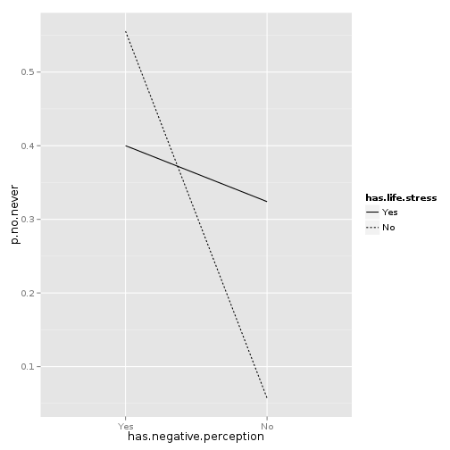

Life stresses mediate an association between negative perception of activism and a decision never to participate
======


## To do
Since we're making a blog post about this, I would add

* A definition of "critical PAR"
* The actual questionnaire questions

## Research question
We wanted to test whether a desire to participate in activim was associated
with increased participation in activism and whether this relationship was
mediated by life stresses.

    +---------------+                   +---------------+
    | Interest in   |                   | Participation |
    | participating |   ------------>   | in activism   |
    | in activism   |                   |               |
    +---------------+        / \        +---------------+
                              | 
                      
                      +---------------+
                      | Life stress   |
                      | (Barriers to  |
                      | participation)|
                      +---------------+

Preferably, we would have had each participant answer the same questions
about her level of interest of participation (such as whether she agrees
with the movement's views or whether she think the movement will have
positive impact) and her life stresses (like working overtime) and her
level of participation.

### The questionnaire
A questionnaire was developed using critical PAR as the methodological approach.
It was based on the collective experiences of the researchers as CUNY students.
Several pilot surveys were distributed on CUNY campuses and at the Free University, an activist event in Madison Square Park that occurred on May 1, 2012. This enabled researchers to revise and build the survey based on feedback from students. Insight from CUNY students was essential in the construction of the survey. Distribution of the final version of the survey began May 1, 2012 and continued until September 16, 2012. Surveys were collected on CUNY campuses, in classrooms, at CUNY activist events, and online.

### Questionnaire distribution
Researchers made contact on various CUNY campuses with professors who might be willing to distribute surveys to students during class time. An effort was made to ensure that the various types of CUNY campuses were included in the study (i.e. community colleges, senior colleges, etc) as well as various types of classes (day classes, night classes, and summer classes). If professors responded positively, a time was arranged during class when researchers could distribute surveys. Surveys
were distributed to children’s studies classes at Brooklyn College, sociology classes at Hunter College, psychology classes at LaGuardia, research methods classes at the CUNY Graduate Center, classes at Medgar Evers college, and classes at the School of Professional Studies. A researcher was present in each classroom to oversee the completion of surveys and collect them. Researchers gave participants a short description of the survey, indicating that researchers were CUNY students interested
in studying activism on CUNY campuses. Anonymity of participants was assured. Consent from participants was obtained verbally and they were given about ten minutes to complete the survey. One professor provided students with a link to fill out the survey online. The remaining surveys were distributed during activist events, including the Free University at Madison Square Park on May 1st, 2012. The Free University was an event where workshops and classes were set up by student activists
in a public space (Madison Square Park) and open to the public. Many CUNY students attended the event, and some took the time to fill out the survey. Surveys were also collected at the CUNY Graduate Center general assembly, which is a student activist event where students meet to discuss issues and organize. Surveys were also distributed in the Hunter College cafeteria and student lounge, as well as at a student speak-out activist event to students who were willing to complete them,. In
these cases, researchers gave participants ten minutes to complete the survey and acquired verbal consent. When researchers obtained a substantial number of surveys from a diverse group of CUNY campuses, data collection ceased. A code book for the survey was created, and all researchers participated in data entry, and eventually compiled all entered data into one Excel spreadsheet.

## The question at hand
The questionnaire asked one question about level of participation
to all participants (question 8).

> 8. Have you ever attended an event on Occupy CUNY/ activism for higher education (e.g., a march, a talk, a general assembly/GA)?
>
> □ Yes, and I want to participate again because ________
> □ Yes, but I do not want to participate again because ________
> □ No, and I will not participate because ________
> □ No. I would like to participate but ________

The questions about interest in participation (question 7) and
about life stress (question 4) were arranged such that people answered different
questions depending on whether they had previously participated in
OccupyCUNY, which is quite related to their level of participation
in activism.

> 3. Are you participating in activism that addresses issues in higher education?  
> □ Yes (go to 4a and 4b)
> □ No  (go to 4c)
> 
> 4a. If Yes, what motivates you?
> 
> 4b. If yes, what enables you to participate? 
>
> * Financial resources
> * Job security
> * Childcare
> * Sense of belonging/community
> * Training in activism skills
> * Having a flexible schedule
> * Support from family, friends, peers, partners 
> * Encouragement at work and union
> * Access to ongoing sources of info
> * Encouragement at school (e.g., Class credits, teacher support, teacher allows me to miss class, inclusion in my academic research)
> * Other concrete things like _______
> 
> 4c. If no, what prevents you from participating? 
>
> * Lack of financial resources
> * Job insecurity
> * No childcare   
> * Inflexible schedule/No time
> * No support from family, friends, peers, partners 
> * Institutional discouragement/limitations at work and union
> * No access to ongoing sources of info
> * Institutional discouragement/limitations at school
> * Surveillance
> * Police violence/threat
> * Consequence of arrests
> * Other _______
> 


> 7a. Overall, how do you feel about Occupy CUNY/ activism for higher education? Check only one. 
> 
> □ Positive
> □ Negative
> □ Ambivalent/ mixed feelings  
> □ I don’t know much about it
> □ I don’t have an opinion
> 
> b. I feel positive about Occupy CUNY/ activism for higher education because: (Check all that apply.)
> □ It opens a dialog about privatization of public higher education 
> □ It is led by students for students   
> □ I feel a part of a movement
> □ It represents common issues faced by the majority of the population
> □ It uses a democratic process  
> □ It uses nonviolent methods
> □ It uses direct action
> □ Other (please specify) ________
> 
> c. I feel negative about Occupy CUNY/ activism for higher education because: (Check all that apply.)
> □ It is not effective
> □ It does not deal with issues that concern me
> □ It is unfocused, and does not have a coherent message
> □ It is disruptive to classes 
> □ Other (please specify) ________


We thus had to separate the analysis by whether people had
previously participated in OccupyCUNY.

There wasn't much separation by level of participation within the
people who said they had participated. (There wer 64 people in the
higher group and 7 in the lower group.) Thus, we only conducted the
analysis for the respondents who said they had not participated in
OccupyCUNY. This led to a reversed framing of the relationship 
described above.

    +---------------+                   +---------------+
    | Negative atti-|                   | Decisiveness  |
    | tude towards  |   ------------>   | about not     |
    | activism      |                   | participating |
    +---------------+        / \        +---------------+
      (question 7c)           |           (question 8)
                      
                      +---------------+
                      | Life stress   |
                      | (Barriers to  |
                      | participation)|
                      +---------------+
                        (question 4c)

### Variables
The questionnaire requested that question 4c only be answered by people who had
answered with one of the two "No" responses to question 8, so we used only the
subset of the data for which question 8 was one of these no responses. We thus
had a binary participation variable, `no.never`, which was true if the
participant said she would never participate and false if she said that she
had not participated but (would like to ?).

For both questions 4c and 7c, almost people checked either zero or one box.
For simplicity, we simply checked whether at least one of the respective
groups of check marks was checked. Thus, our life stress variable,
`has.life.stress`, was true if at least one of question 4c's boxes was checked
and false if none was checked. Similarly, our variable for negative perception
of activism, `has.negative.perception`, was true if at least one of 7c's
boxes was checked and false if none were.

We chose variable names that start with the word "has" so that it would be less
confusing to talk about, but both groups obviously have both life stresses
and some negative perception of activism; if these names bother you, mentally
switch the "has" to "has more".

## Results

This sample consisted of 304 current students attending various CUNY campuses. The survey was distributed on a total of twelve CUNY campuses, mostly from Hunter College (29% of sample), Brooklyn College (19%), Medgar Evers College (16%), Laguardia Community College (13%), and the Graduate Center (10%). The remaining CUNY schools include the School of Professional Studies (5%), Baruch College (1.6%), John Jay College of Criminal Justice (.7%), Borough of Manhattan Community College
(.3%), City College of New York (.3%), Lehman College (.3%), and Queens College (.3%). Several participants did not provide their campus name (5%). Students were pursuing various degrees, most commonly a Bachelors degree (60%), followed by Associates (13%), Doctorate (10%), Masters (5%), Certificate (1%), or Non-degree seeking students (1%), and 11% were unknown. When asked for their gender, the majority of participants  identified as female (67.4%), while 27% were male, 2% were queer, and
3% did not include their answer in this portion of the survey. Official records state that CUNY students are 58% female and 42% male (CUNY Office of Institutional Research and Assessment, 2011), although it should be noted they do not include alternative gender categories. It also states that 28.2% of CUNY students are age 25 or older. The ages of this sample ranged from 18 to 58, with 50% of participants between the ages of 21 and 29. The average age of this sample was 26.5. The sample
was fairly representative of the CUNY student body. 

### 
We have two binary independent variables, so $$2^2 = 4$$ different combinations.
For our sample, here are the proportions of people within each group who said
"never" (rather than "no, ... but").


```
       has.life.stress has.negative.perception p.no.never
     1             Yes                     Yes        40%
     2             Yes                      No      32.4%
     3              No                     Yes      55.6%
     4              No                      No       5.7%
```


### Logistic regression
We fit two logistic regressions and compared them with a likelihood ratio test.
As a null model, we fit the simple logistic regression of `no.never` as a
function of `has.negative perception`, ignorant of `has.life.stress`.


```
     
     Call:
     glm(formula = no.never ~ has.negative.perception, family = "binomial", 
         data = o)
     
     Deviance Residuals: 
        Min      1Q  Median      3Q     Max  
     -1.047  -0.774  -0.774   1.314   1.644  
     
     Coefficients:
                             Estimate Std. Error z value Pr(>|z|)    
     (Intercept)               -1.053      0.191   -5.51  3.5e-08 ***
     has.negative.perception    0.737      0.317    2.33     0.02 *  
     ---
     Signif. codes:  0 '***' 0.001 '**' 0.01 '*' 0.05 '.' 0.1 ' ' 1 
     
     (Dispersion parameter for binomial family taken to be 1)
     
         Null deviance: 256.03  on 206  degrees of freedom
     Residual deviance: 250.67  on 205  degrees of freedom
     AIC: 254.7
     
     Number of Fisher Scoring iterations: 4
```


The `has.negative.perception` coefficient is significantly different from zero,
indicating that negative perception is associated with participation.

Then we fit a logistic regression for the full relationship described above,
which adds the `has.life.stress` term.


```
     
     Call:
     glm(formula = no.never ~ has.life.stress * has.negative.perception, 
         family = "binomial", data = o)
     
     Deviance Residuals: 
        Min      1Q  Median      3Q     Max  
     -1.274  -0.885  -0.885   1.354   2.393  
     
     Coefficients:
                                             Estimate Std. Error z value Pr(>|z|)    
     (Intercept)                               -2.803      0.728   -3.85  0.00012 ***
     has.life.stress                            2.068      0.757    2.73  0.00627 ** 
     has.negative.perception                    3.027      0.990    3.06  0.00224 ** 
     has.life.stress:has.negative.perception   -2.697      1.048   -2.57  0.01007 *  
     ---
     Signif. codes:  0 '***' 0.001 '**' 0.01 '*' 0.05 '.' 0.1 ' ' 1 
     
     (Dispersion parameter for binomial family taken to be 1)
     
         Null deviance: 256.03  on 206  degrees of freedom
     Residual deviance: 237.79  on 203  degrees of freedom
     AIC: 245.8
     
     Number of Fisher Scoring iterations: 5
```


All of the non-intercept coefficients significantly different from zero,
indicating that negative perception and life stress, separately, are both
associated with participation and that the associations are different
when combined. Specifically, someone with just negative perception or life
has higher odds of saying "never" than someone with neither, but the odds
are somewhere in between for someone who has both negative perception and
life stress.

Finally, we compared the two with a likelihood ratio test.


```
     Likelihood ratio test for MLE method 
     Chi-squared 2 d.f. =  12.88 , P value =  0.001594
```


The likelihood ratio test finds that the data are significantly more likely
given the full model than the null model, suggesting, again, that life stress
significantly mediates the relationship between negative perception and
participation in activism.

### Ordinary least squares
We repeated this analysis with ordinary least squares (OLS) regressions,
swapping the likelihood ratio test for an F test. Logistic regression is more
appropriate for these data because they have a binary response, but the OLS
results are similar and may be easier for some people to understand.


```
     
     Call:
     lm(formula = no.never ~ has.negative.perception, data = o)
     
     Residuals:
        Min     1Q Median     3Q    Max 
     -0.422 -0.259 -0.259  0.578  0.741 
     
     Coefficients:
                             Estimate Std. Error t value Pr(>|t|)    
     (Intercept)               0.2587     0.0383    6.75  1.5e-10 ***
     has.negative.perception   0.1631     0.0689    2.37    0.019 *  
     ---
     Signif. codes:  0 '***' 0.001 '**' 0.01 '*' 0.05 '.' 0.1 ' ' 1 
     
     Residual standard error: 0.458 on 205 degrees of freedom
     Multiple R-squared: 0.0266,	Adjusted R-squared: 0.0219 
     F-statistic:  5.6 on 1 and 205 DF,  p-value: 0.0188
```

```
     
     Call:
     lm(formula = no.never ~ has.life.stress * has.negative.perception, 
         data = o)
     
     Residuals:
        Min     1Q Median     3Q    Max 
     -0.556 -0.324 -0.324  0.600  0.943 
     
     Coefficients:
                                             Estimate Std. Error t value Pr(>|t|)   
     (Intercept)                               0.0571     0.0759    0.75   0.4526   
     has.life.stress                           0.2669     0.0874    3.06   0.0026 **
     has.negative.perception                   0.4984     0.1679    2.97   0.0034 **
     has.life.stress:has.negative.perception  -0.4225     0.1836   -2.30   0.0224 * 
     ---
     Signif. codes:  0 '***' 0.001 '**' 0.01 '*' 0.05 '.' 0.1 ' ' 1 
     
     Residual standard error: 0.449 on 203 degrees of freedom
     Multiple R-squared: 0.0734,	Adjusted R-squared: 0.0598 
     F-statistic: 5.36 on 3 and 203 DF,  p-value: 0.00142
```

```
     Analysis of Variance Table
     
     Model 1: no.never ~ has.negative.perception
     Model 2: no.never ~ has.life.stress * has.negative.perception
       Res.Df RSS Df Sum of Sq    F Pr(>F)   
     1    205  43                            
     2    203  41  2      2.07 5.13 0.0067 **
     ---
     Signif. codes:  0 '***' 0.001 '**' 0.01 '*' 0.05 '.' 0.1 ' ' 1
```


## Not experimental
We intuitively suspect a particular direction of causality and have fit models
that suggest that direction, but the questionnaire gives us no formal idea
about the direction of causality; for example, it could be that the choice never
to participate leads to overstatement of reasons against participation and
of life stresses.

## Conclusion
Life stresses mediate an association between negative perception of activism
and a decision never to participate in Occupy CUNY. For interpreting the
direction of this relationship, the following plot is helpful.

 


Negative perception makes people more likely to say they will "never"
participate, regardless of the level of life stress, and having life stress
makes this difference larger.

## Ideas for future study
We ignored which boxes people checked for questions 4c and 7c. It may be
informative to see how the particular box that was checked relates to
the question 8 result or other results.

## Relevance
The conclusion of this study can be applied to the marketing surrounding
activism. Aside from trying to influence people's perception of the
value of activism, marketing should consider activists' life stresses.

People who are trying to recruit and sustain activists should
focus on people with fewer life stresses or should provide support to
current and potential activists who have more life stresses.

People who are trying to suppress activism should focus on people with
more life stresses or should try to make the lives of potential and
current activists more stressful.

## The research team
The research team was initially composed of twelve individuals, including four CUNY undergraduate students, seven CUNY graduate students, and one alumnus. Most individuals on the research team had previous experience as student activists addressing issues at CUNY schools.  The group met consistently from February, 2012 to May, 2012 in order to develop a survey designed to find the supports and barriers to student activism on CUNY campuses. During this time, one undergraduate student and one graduate student dropped out of the study. The research team had ten members when the survey was finalized.

