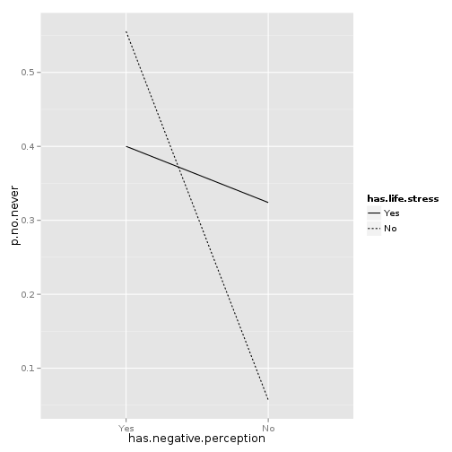

Life stresses mediate an association between negative perception of activism and a decision never to participate
======


## Variables


questions 4c, 7c and 8

The questionnaire requested that question 4c only be answered by people who had
answered with one of the two "No" responses to question 8, so we used only the
subset of the data for which question 8 was one of these no responses. We thus
had a binary participation variable, `no.never`, which was true if the
participant said she would never participate and false if she said that she
had not participated but (would like to ?).

For both questions 4c and 7c, almost people checked either zero or one box.
For simplicity, we simply checked whether at least one of the respective
groups of check marks was checked. Thus, our life stress variable,
`has.life.stress`, was true if at least one of question 4c's boxes was checked
and false if none was checked. Similarly, our variable for negative perception
of activism, `has.negative.perception`, was true if at least one of 7c's
boxes was checked and false if none were.

We chose variable names that start with the word "has" so that it would be less
confusing to talk about, but both groups obviously have both life stresses
and some negative perception of activism; if these names bother you, mentally
switch the "has" to "has more".

## Results
We have two binary independent variables, so $$2^2 = 4$$ different combinations.
For our sample, here are the proportions of people within each group who said
"never" (rather than "no, ... but").


```
       has.life.stress has.negative.perception p.no.never
     1             Yes                     Yes        40%
     2             Yes                      No      32.4%
     3              No                     Yes      55.6%
     4              No                      No       5.7%
```

 


### Logistic regression
We fit two logistic regressions and compared them with a likelihood ratio test.
As a null model, we fit the simple logistic regression of `no.never` as a
function of `has.negative perception`, ignorant of `has.life.stress`.


```
     
     Call:
     glm(formula = no.never ~ has.negative.perception, family = "binomial", 
         data = o)
     
     Deviance Residuals: 
        Min      1Q  Median      3Q     Max  
     -1.047  -0.774  -0.774   1.314   1.644  
     
     Coefficients:
                             Estimate Std. Error z value Pr(>|z|)    
     (Intercept)               -1.053      0.191   -5.51  3.5e-08 ***
     has.negative.perception    0.737      0.317    2.33     0.02 *  
     ---
     Signif. codes:  0 '***' 0.001 '**' 0.01 '*' 0.05 '.' 0.1 ' ' 1 
     
     (Dispersion parameter for binomial family taken to be 1)
     
         Null deviance: 256.03  on 206  degrees of freedom
     Residual deviance: 250.67  on 205  degrees of freedom
     AIC: 254.7
     
     Number of Fisher Scoring iterations: 4
```


The `has.negative.perception` coefficient is significantly different from zero,
indicating that negative perception is associated with participation.

Then we fit a logistic regression for the full relationship described above,
which adds the `has.life.stress` term.


```
     
     Call:
     glm(formula = no.never ~ has.life.stress * has.negative.perception, 
         family = "binomial", data = o)
     
     Deviance Residuals: 
        Min      1Q  Median      3Q     Max  
     -1.274  -0.885  -0.885   1.354   2.393  
     
     Coefficients:
                                             Estimate Std. Error z value Pr(>|z|)    
     (Intercept)                               -2.803      0.728   -3.85  0.00012 ***
     has.life.stress                            2.068      0.757    2.73  0.00627 ** 
     has.negative.perception                    3.027      0.990    3.06  0.00224 ** 
     has.life.stress:has.negative.perception   -2.697      1.048   -2.57  0.01007 *  
     ---
     Signif. codes:  0 '***' 0.001 '**' 0.01 '*' 0.05 '.' 0.1 ' ' 1 
     
     (Dispersion parameter for binomial family taken to be 1)
     
         Null deviance: 256.03  on 206  degrees of freedom
     Residual deviance: 237.79  on 203  degrees of freedom
     AIC: 245.8
     
     Number of Fisher Scoring iterations: 5
```


All of the non-intercept coefficients significantly different from zero,
indicating that negative perception and life stress, separately, are both
associated with participation and that the associations are different
when combined. Specifically, someone with just negative perception or life
has higher odds of saying "never" than someone with neither, but the odds
are somewhere in between for someone who has both negative perception and
life stress.

Finally, we compared the two with a likelihood ratio test.


```
     Likelihood ratio test for MLE method 
     Chi-squared 2 d.f. =  12.88 , P value =  0.001594
```


The likelihood ratio test finds that the data are significantly more likely
given the full model than the null model, suggesting, again, that life stress
significantly mediates the relationship between negative perception and
participation in activism.

### Ordinary least squares
We repeated this analysis with ordinary least squares (OLS) regressions,
swapping the likelihood ratio test for an F test. Logistic regression is more
appropriate for these data because they have a binary response, but the OLS
results are similar and may be easier for some people to understand.


```
     
     Call:
     lm(formula = no.never ~ has.negative.perception, data = o)
     
     Residuals:
        Min     1Q Median     3Q    Max 
     -0.422 -0.259 -0.259  0.578  0.741 
     
     Coefficients:
                             Estimate Std. Error t value Pr(>|t|)    
     (Intercept)               0.2587     0.0383    6.75  1.5e-10 ***
     has.negative.perception   0.1631     0.0689    2.37    0.019 *  
     ---
     Signif. codes:  0 '***' 0.001 '**' 0.01 '*' 0.05 '.' 0.1 ' ' 1 
     
     Residual standard error: 0.458 on 205 degrees of freedom
     Multiple R-squared: 0.0266,	Adjusted R-squared: 0.0219 
     F-statistic:  5.6 on 1 and 205 DF,  p-value: 0.0188
```

```
     
     Call:
     lm(formula = no.never ~ has.life.stress * has.negative.perception, 
         data = o)
     
     Residuals:
        Min     1Q Median     3Q    Max 
     -0.556 -0.324 -0.324  0.600  0.943 
     
     Coefficients:
                                             Estimate Std. Error t value Pr(>|t|)   
     (Intercept)                               0.0571     0.0759    0.75   0.4526   
     has.life.stress                           0.2669     0.0874    3.06   0.0026 **
     has.negative.perception                   0.4984     0.1679    2.97   0.0034 **
     has.life.stress:has.negative.perception  -0.4225     0.1836   -2.30   0.0224 * 
     ---
     Signif. codes:  0 '***' 0.001 '**' 0.01 '*' 0.05 '.' 0.1 ' ' 1 
     
     Residual standard error: 0.449 on 203 degrees of freedom
     Multiple R-squared: 0.0734,	Adjusted R-squared: 0.0598 
     F-statistic: 5.36 on 3 and 203 DF,  p-value: 0.00142
```

```
     Analysis of Variance Table
     
     Model 1: no.never ~ has.negative.perception
     Model 2: no.never ~ has.life.stress * has.negative.perception
       Res.Df RSS Df Sum of Sq    F Pr(>F)   
     1    205  43                            
     2    203  41  2      2.07 5.13 0.0067 **
     ---
     Signif. codes:  0 '***' 0.001 '**' 0.01 '*' 0.05 '.' 0.1 ' ' 1
```


## Not experimental
We intuitively suspect a particular direction of causality and have fit models
that suggest that direction, but the questionnaire gives us no formal idea
about the direction of causality; for example, it could be that the choice never
to participate leads to overstatement of reasons against participation and
of life stresses.

## Ideas for future study
We ignored which boxes people checked for questions 4c and 7c. It may be
informative to see how the particular box that was checked relates to
the question 8 result or other results.
